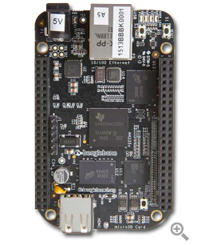

**Project Description**
Windows Embedded BSP for the BeagleBone. Support for Windows Embedded Compact 7 and Windows Embedded Compact 2013 running on BeagleBone White and BeagleBone Black.

Based on the TI AM335x ARM Cortex-A8 processor.

Prebuilt demo images available for download and evaluation.

For engineering services contact me through my Codeplex account.
My blog:[http://www.embedded101.com/Blogs/David-Vescovi](http://www.embedded101.com/Blogs/David-Vescovi)

For Gumstix Overo see the sister site [http://gumstixbsp.codeplex.com/](http://gumstixbsp.codeplex.com/)
For original BeagleBoard see the sister site [http://beagleboardbsp.codeplex.com/](http://beagleboardbsp.codeplex.com/)

Graphics video:[http://youtu.be/htUqCHq3M4s](http://youtu.be/htUqCHq3M4s)

Includes:
-High speed eMMC support
-eMMC support
-512MB RAM support
-Persistent registry support
-HDMI/DVI display support
-LCD support
-Supports BeagleBone White and Black
-Dynamic CAPE detection

If you have some custom peripheral or cape you would like to see integrated, supply me with the hardware and I'll add it to the BSP for free (or for a small nominal fee).

The source is available free for download. (please donate)

**Built and maintained in the U.S.A.!!**

